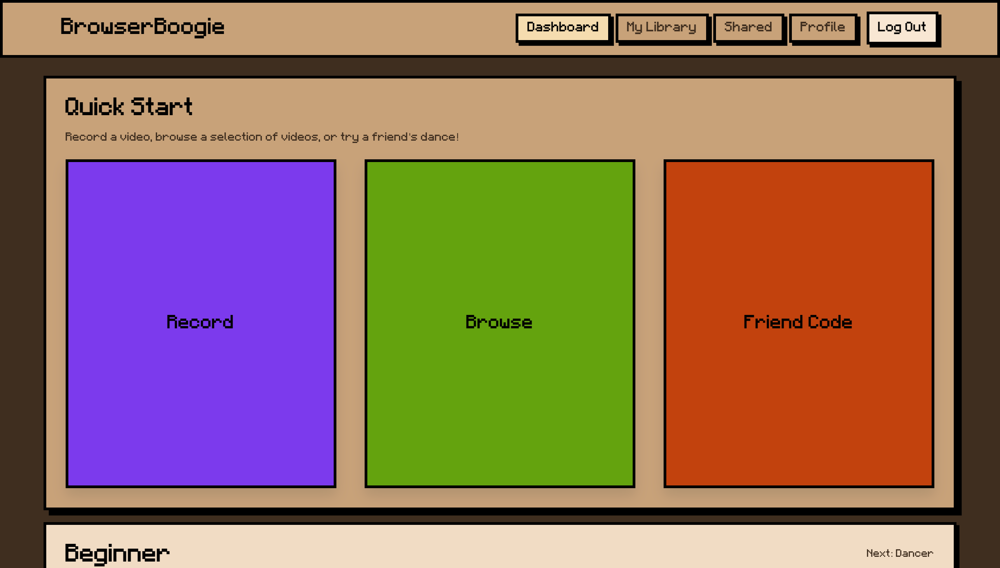

# BrowserBoogie

Originally built for HooHacks 2026 by Anmol Thapa, Shaunak Dogra, and Ekamjot Singh.
Devpost: https://devpost.com/software/browserboogie

Further developed and cleaned up for deployment by Anmol Thapa.

## What it is

BrowserBoogie is a webcam-based dance scoring app that runs entirely in the browser. You record a routine using your webcam, then play it back and score yourself against it in real time. Pose detection runs client-side via MediaPipe, so no video is ever sent to a server for processing.



## Features

### Recording

- Record a dance routine with your webcam against any audio file
- Configurable countdown before recording starts
- Optional webcam video capture alongside the pose skeleton data
- Side-by-side or raw webcam layout options for the recorded video
- Hard cap of 2 minutes per recording

### Playback and Scoring

- Play back any routine and score yourself frame by frame against the reference skeleton
- Live score and running average displayed during playback
- Difficulty settings (Easy, Medium, Hard) with different angle tolerance and scoring windows
- View modes: overlay (reference skeleton drawn over your live feed), skeleton on side (reference skeleton in a separate panel next to your live feed, no reference video required), side-by-side (your webcam feed next to the reference recording), or none (pure memorisation)
- Configurable countdown before playback starts
- Pause and resume mid-session; only completed playthroughs count toward stats
- Letter grade on completion (A, B, C, D, F)

### Import

- Import from video: upload any video file and the app extracts pose frames to build a playable routine
- Videos over 2 minutes are trimmed automatically in-browser using FFmpeg.wasm
- Import via friend code: paste a share code to load someone else's routine directly into your library

### Library

- Sessions saved to your account via Supabase Storage and Postgres
- Up to 10 recordings per account
- Delete sessions individually; deleting a shared session revokes the share code

### Sharing

- Generate a share code for any completed Play session
- Option to share pose data only, stripping your webcam video before upload
- Manage or revoke existing share codes from the Shared tab

### Stats and Progression

- Per-user stats tracked across all completed runs: total runs, average score, grade
- XP system: 10 XP per completed playthrough, with a difficulty multiplier (Easy x1, Medium x1.15, Hard x1.25)
- Three levels based on XP: Beginner, Dancer, Dancing Legend
- Achievements: First Move (first completed dance), Getting Used To It (10 completed dances), Duet (complete a shared session)
- Recent runs list with direct links back to the session

### Browse

- Browse public preset routines uploaded to Supabase (admin-controlled)
- Open any preset directly into your library as a Play session

### Auth

- Email and password sign-up and login
- Forgot password and reset password flow via email link
- Change password from Settings (requires current password)
- Account deletion with all associated data removed

## Tech stack

- React 18, TypeScript, Vite
- MediaPipe Tasks Vision (pose landmarking, runs fully client-side via WASM)
- Supabase (auth, Postgres, Storage)
- FFmpeg.wasm (in-browser video trimming)
- JSZip (routine package bundling)

## Setup

1. Create a Supabase project and set up the schema (see below).
2. Copy `.env.example` to `.env` and fill in your values:

```
VITE_SUPABASE_URL=your_project_url
VITE_SUPABASE_ANON_KEY=your_anon_key
```

3. Install and run:

```bash
npm install
npm run dev
```

### Required Supabase schema

Tables needed (all with RLS enabled):

- `folders` - stores session manifests and file metadata
- `shares` - share codes linking to folder records
- `user_stats` - per-user run history and aggregate scores

Storage bucket: `recordings` (private), with objects keyed by `<user_id>/<folder_id>/<filename>`.

RPC functions needed:

- `get_shared_folder(share_code text)` - validates a share code and returns the folder row with signed URLs
- `delete_my_account()` - deletes the calling user's data and account
- `list_public_presets()` - returns folder rows marked `is_public = true` for the Browse tab
